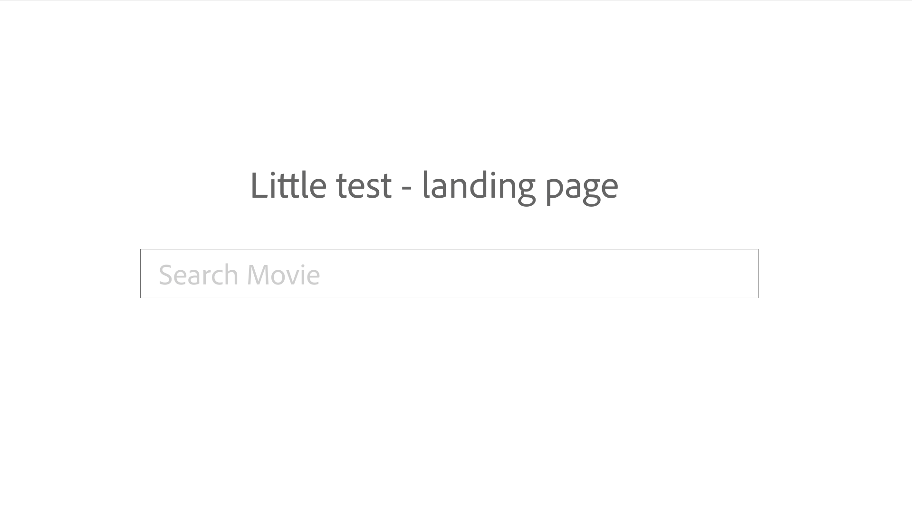
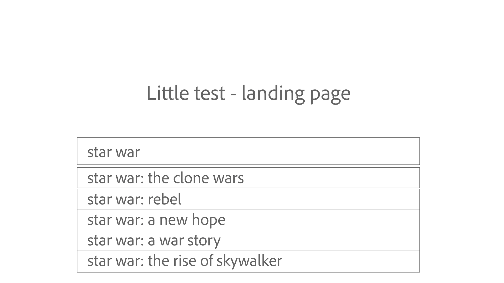
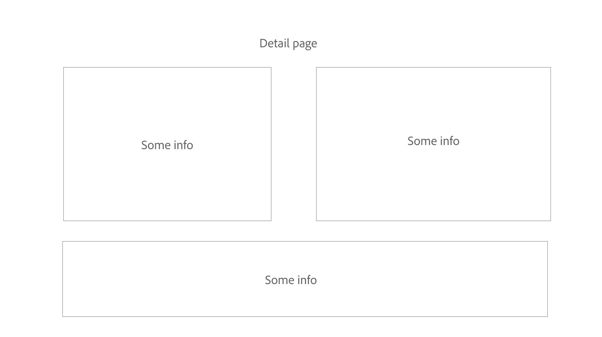

# Coding Homework

Hi there! This is a simple coding test from Spark Sport. We like you! And we would like to know more about you, now this stage you can demonstrate us your awesome coding skills! We writing code every day, now we want to know how you write code as well!

So, let's build a web application, that we can use to search for movies and display the detail of the movie!

This test should be completed using ReactJS and ideally Redux (but not compulsary).

## Design / User flow

Full flow can get here: https://xd.adobe.com/view/0b6f9418-1224-418c-b1bb-7fad2462bbe1-5e3c/

### Home page

This is the home page of the app. With whatever you like to name this application and a search box.

### Search function

When typing something in the search box, it will list related result like the autocomplete you saw in Google search or any other search.

No need to show all the results, probably just a few most related results should be enough.

### Detail page

Once you click a movie in the autocomplete drop-down list, will navigate you to the detail page, in this page, you might see the movie poster, title, actors etc. whatever other information you think you wish to have

## API

We suggest that you can use [The Movie DB API](https://developers.themoviedb.org/3/getting-started), and you might need to [register](https://www.themoviedb.org/login) and create an API key for it.

For search the movie with text, you can use this endpoint: https://developers.themoviedb.org/3/search/search-movies

For the detail of a movie, you can use this endpoint: https://developers.themoviedb.org/3/movies/get-movie-details

An example of the API call will be like this: https://api.themoviedb.org/3/search/movie?query={key_word}?&api_key={api_key}

_If you have problem with API setup, local static data demo is also acceptable_

## Some kind tips

- We favour unit tested code, but not a must-have
- Don't forget to create/update README to let us know how to set up and run your code.
- You can branch this repo and complete work in your own branch.
- No need to stress off, enjoy coding, be yourself and good luck!
